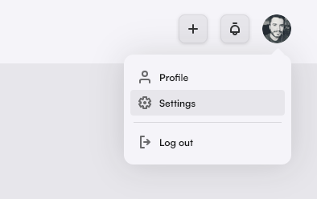
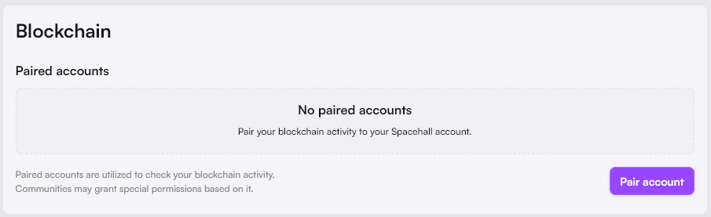
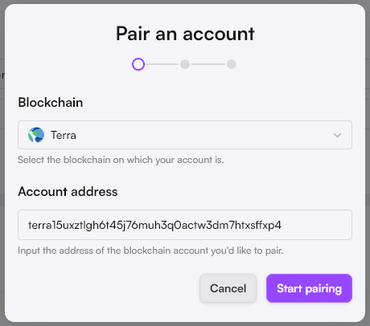
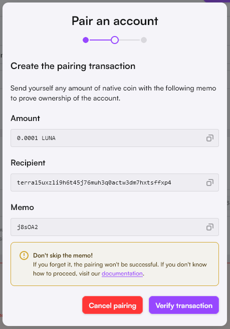

# Blockchain pairing

### Purpose

Pairing a blockchain account to your Spacehall account enables communities to give you specific permissions related to your on-chain activity.

For example:

* A layer one blockchain community could only allow user interactions from users with a paired account on their blockchain.
* A  validator community could only allow user interactions from users who delegate to them on given chains.
* A DAO community could only allow user interactions with users who are part of their DAO.

### Pair a blockchain account.

1. Go to your account settings by clicking on your avatar in the top right corner and then "settings."

<figure><figcaption>
Access your account settings
</figcaption></figure>

2. Scroll to the "Blockchain" section at the bottom and click "Pair account."

<figure><figcaption>
Start the pairing process
</figcaption></figure>

3. Select the blockchain on which your account is and its address. Then click on "Start pairing".

<figure><figcaption>
Input your account information
</figcaption></figure>

4. You're now presented with the details of the unique pairing transaction you need to execute to confirm the ownership of your account.

<figure><figcaption>
Pairing transaction details
</figcaption></figure>

5. Using your favorite wallet, send a transaction from the blockchain account you're trying to pair with the information you got from point 4.


The transaction recipient should be the address of the account you are trying to pair. Do not copy the one in the screenshot.



Do not forget to set the memo. Verification will fail if absent.


5. Then click "Verify transaction." Once your transaction is found, your blockchain account will be automatically paired with your Spacehall account.
6. You can wait until the verification is done or close the modal, as it will continue in the background.

<figure><figcaption></figcaption></figure>

